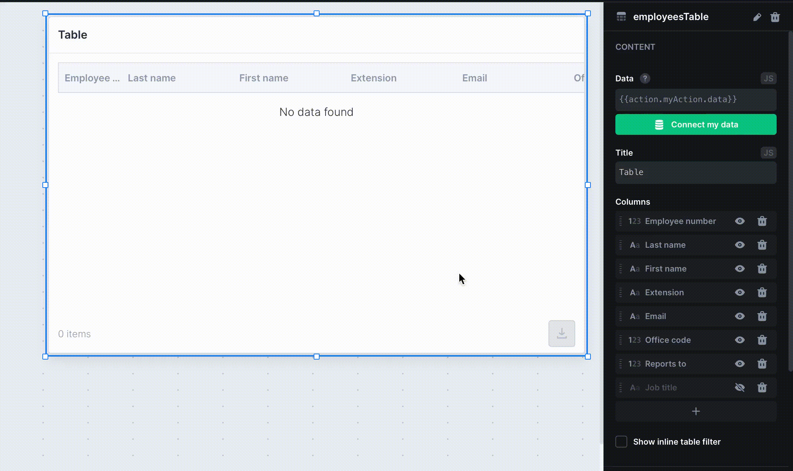
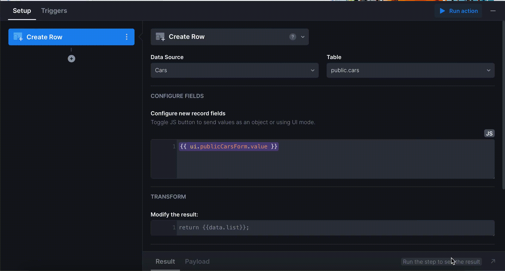

# Actions

**Action** is a piece of business logic implemented in your application. You can use it to load data from Data sources, send data back, make API calls, navigate to a page, generate PDF documents or process any type of data with SQL or JavaScript.

Any Action can contain multiple **Action steps**. These are small jobs of various types: SQL query, Custom code, HTTP request, Condition, Navigation. By combining multiple steps, you can build functional workflows, unite requests to different data sources, validate input data, or reload the data based on a specific condition.

#### Creating an action

Open Actions panel from the bottom of the builder area. Click the **+** button on the right of the **Actions** list.

Select the first appropriate step (the choice depends on the type of Action you are going to create).&#x20;


You can also create complex multi-step actions. All the steps will be executed sequentially as you ordered them.


#### Triggering event-based Actions

Actions that load data are auto-callable. This means that if you've assigned an Action to the **Data** **property** of the Component, you don't need to trigger the Action. It will be called when the Component is displayed on a page load.

When submitting a Form, performing a search, or reloading a Table with a button click, you need to assign the action to a particular Component trigger:

.gif>)

Actions can also be called from any code field using the following syntax:

```javascript
{{actions.loadUsers.trigger()}}
```

You can **pass an argument** to an Action and it will appear as a `{{data}}` variable in the first Action step.

```javascript
{{ actions.loadUsers.trigger({ limit: 10 }) }}
```

#### Using Action result

An Action can be assigned to a Component using its result as a **variable** in the code properties and fields:

```javascript
{{actions.loadUsers.data}}
```



Any Action has two additional variables. They can be used to indicate that an Action is loaded, or to access an error that the Action was completed with:

```javascript
{{actions.loadUsers.loading}} // boolean true or false
{{actions.loadUsers.error}} // possible error object
```

#### Using the previous step result

Any Action step can produce a result or an error. Both will be available as variables in the next Action step.

```javascript
{{data}} // result of the previous action step
{{error}} // if catched, error thrown by the previous step
```

Thus, you can consequently make requests, enrich or transform data, make navigation to a particular page, based on the result of a previous execution, or show an error to a user.

#### Creating a condition

You can also create conditions inside of Actions to validate the input before executing a request, for instance:


Conditions are written in plain JavaScript.

#### Reusing actions

Actions can be called from the other Actions with the help of an **Execute action** step. It's useful when it comes to reloading data after creating a new item.


By default, the result of a step that goes _before_ the Execute action step will appear as a `{{data}}` variable in the first step of the Action being called. The result of the Action being called using an Execute action step will appear in the _next step_ that comes right after the Execute action step.


Additionally, you can trigger another action on the **Triggers** tab on success or on error results:


