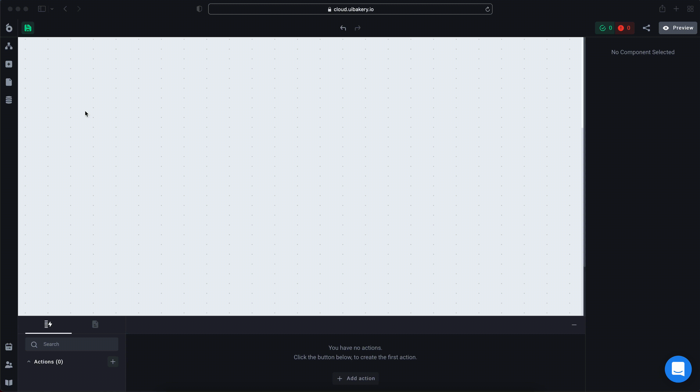
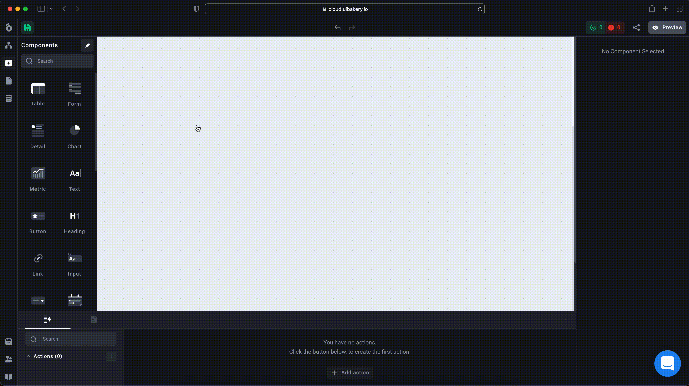

# Components

**Components** are the building blocks of the application interface. There are a number of prebuilt components available in UI Bakery. You can also build custom components using React, jQuery, ViewJS, or JavaScript.

Components are available from the left side panel. The components panel can be pinned or unpinned. When unpinned, it will hide automatically when you don’t use it.



#### The basics

To add any Component to your app page, drag-and-drop it from the sidebar to your working area.




If you have an Action that is currently selected in the Actions panel, UI Bakery will try to automatically connect a newly added component to this action. It will also generate a component structure from the action's response and its types.


To change the Component size, click and drag the corner resize handlers.


While the Component is selected, you can configure its properties via the right sidebar. Here, you can change its structure, adjust settings, and styles.


To remove a Component, click on the Bin icon:


#### Connecting to data

To change the Component data, remove the previously connected data, and select a new Action or a Component property. Once selected, you can auto-sync the new Action's structure. Thus, you won't need to build a Component structure from scratch.


#### Accessing component Variables

Such Components as Inputs, Date pickers, File pickers, and complex Components like Forms and Tables can produce values. When you enter something into an input, select a row in a table or submit a form, you can use component values as **a Variable.**

.gif>)

All Components that can produce values are available as variables under:

```
{{ui.componentName.*}}
```

Type `{{ui.` in any code or text field in the Component or Action settings to see a list of available Variables.

Simple Components such as Inputs and Date pickers have a value property only. It's a reference to the current Component value:

```
{{ui.input.value}} // current input value
```

In the case of a Form component, the value key will be a reference to the whole Form object. The keys represent the Form input names and values:

```
{{ui.form.value}} // { name: 'John', age: 30 }
```

A Table component has multiple keys, such as `selectedRow`, `editedRow`, `newRow` and `deletedRow` with the inners properties:

```
{{ui.table.selectedRow.isSelected}} // true/false
{{ui.table.selectedRow.data}} // selected row {} or null
{{ui.table.editedRow.data}} // edited {} BEFORE the edit
{{ui.table.editedRow.newData}} // edited {} AFTER the edit
{{ui.table.newRow.newData}} // newly created row {}
{{ui.table.deletedRow.data}} // deleted row {}
```
