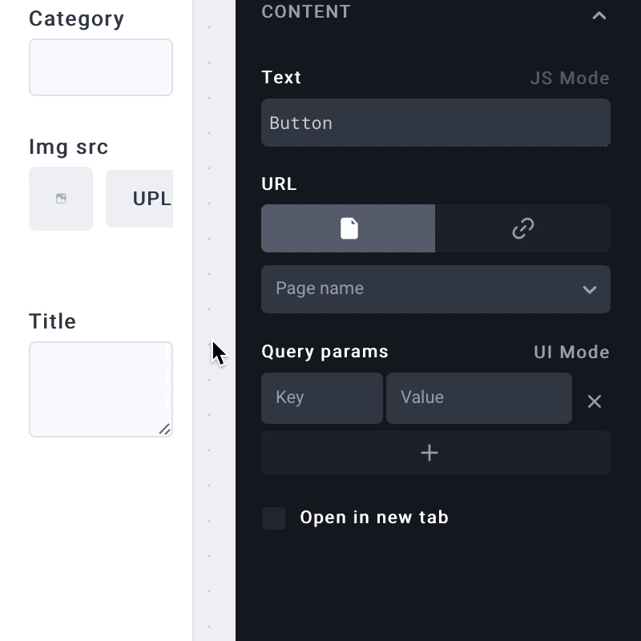

# Variables

**Variables** serve as a glue allowing you to use the Action data in UI components and other Actions. You can also use Component values in the Actions or other Components. To distinguish from JavaScript variables,  UI Bakery variables are always wrapped with `{{ }}` :

#### What you can use as Variables

Component values, action results, state variables, page parameters, etc. are available as variables.

#### Where to find variables

Variables can be used in the properties of Components and Actions. Non-text component properties can be turned into code fields with the help of the `UI Mode/JS Mode` toggle on the right of the property label:

To start searching for a Variable, type `{{` in the code or text field. A variables selector will appear. Choose a Variable here, or search for one:


Use **Option ⌥ + Esc** (Mac) or **Ctrl + Space** (Windows/Linux) as shortcuts to open the variables selector.


There are the following root categories of the Variables:

* **ui**.\* – a list of all app Components.
* **actions**.\* – a list of all app Actions.
* **data** – the previous Action step result or action input.
* **error** – the previous Action step error.
* **state**.\* – custom user Variables.
* **routes**.\* – all app pages and URLs.
* **activeRoute** – a current page URL and parameters.
* **user** – a currently logged-in user.


`{{data}} {{error}}` are only available inside of Actions and reference **the previous Action step result or the Action input**.

