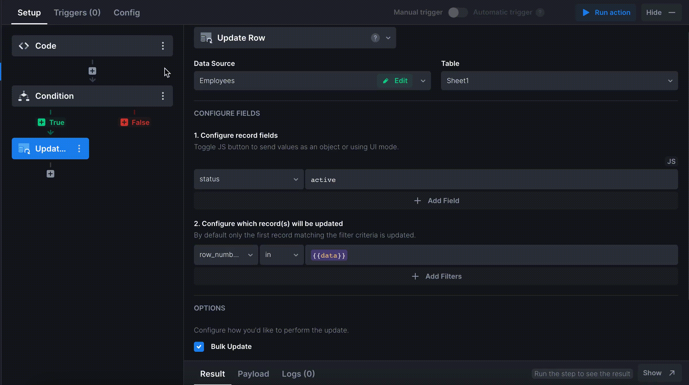

# Select multiple table rows

### Batch update


For a bulk rows update, follow the steps below:


We assume that you already have a table with loaded data&#x20;


1. Add a new column to your table and set its field type to boolean. It will be used as a checkbox.
2. Create a new multi-step action. Add **Code** as a first step. Specify the code below that should filter and map the selected rows:

```javascript
return {{ui.yourTable.value}}.filter(item => item.Select).map(item => item.id)
```

3\. Next, add a **Condition** step. Specify the code: `return {{data.length>0}};`


4\. For the <mark style="color:green;">**true**</mark> condition, add the next action step as **Update Row**. Configure the action in the following way:

* On the **Configure record fields** tab, specify the parameter that will be updated. For the example, we will update `status` parameter by setting it to `active`.


* On the **Configure which record(s) will be updated** tab, specify the identifier for the updated records as `row_number_id` in `{{data}}`.&#x20;

5\. Tick the **Bulk Update** checkbox.


6\. Assign an action that loads your data into the table to the _**On Success**_ trigger.



7\. Finally, add a toggle or a button and assign the newly added action that deletes the records to the button _**On Click/ On Change**_ trigger.


### Batch delete


To delete several rows at a time, follow these steps:


We assume that you already have a table with loaded data&#x20;


1. Add a new column to your table and set its field type to boolean. It will be used as a checkbox.&#x20;
2. Create a new multi-step action. Add **Code** as a first step. Specify the code below that should filter and map the selected rows:

```javascript
return {{ui.yourTable.value}}.filter(item => item.Select).map(item => item.id)
```

3\. Set the next action step as **Condition**. Add the code `return {{data.length>0}};`


4\. For the <mark style="color:green;">**true**</mark> condition, add the next action step as **Delete Row**. Configure which records will be deleted, as `row_id` in `{{data}}.`

5\. Tick the **Bulk Delete** checkbox.


6\. Assign an action that loads your data into the table to the _**On Success**_ trigger.


7\. Finally, add a button and assign the newly added action that deletes the records to the button _**On Click**_ trigger.

.gif>)
