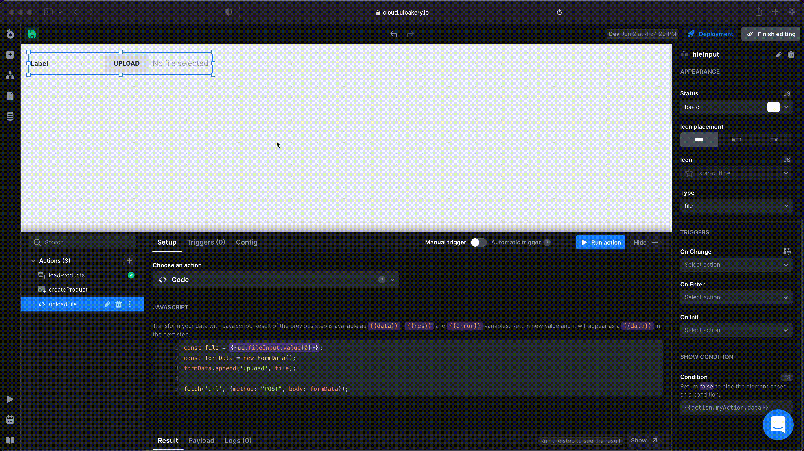
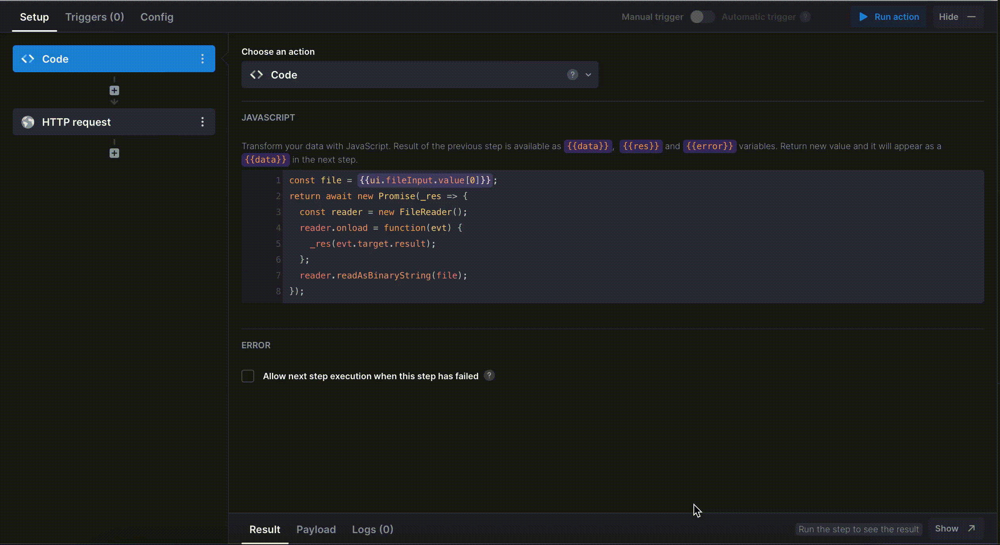

# Uploading the files

To upload the files from UI Bakery to your database, there are two approaches:

### Uploading the files via FETCH method

The first approach to upload the files into your database is by using the FETCH method.

1. Add an input component, and change its type to `file`.
2. Create the **Code** action, and specify the code as below:&#x20;

```javascript
const file = {{ui.fileInput.value[0]}};
const formData = new FormData();
formData.append('upload', file);

fetch('https://mycompany.com/api/upload-file', {method: "POST", body: formData});
```

replace `'url'` with the necessary URL.


3\. Assign the action _**OnChange**_ trigger of the input or add a button and assign the action on the button's click.



### Uploading the files by sending a binary string&#x20;

You can also send a file as a binary string instead of FormData.

1. Add an input component, and change its type to `file`.
2. Add a multi-step action. The first step should be a **Code** step with the below code:

```javascript
const file = {{ui.fileInput.value[0]}};
return await new Promise(_res => {
  const reader = new FileReader();
  reader.onload = function(evt) {
    _res(evt.target.result);
  };
  reader.readAsBinaryString(file);
});
```

3\. Add **HTTP request** as a second step of the action. Select POST method, add your base URL, and specify this code into the body of your request:

```javascript
{
   binaryFile: {{data}}
} 
```




Note! For this approach, the server should know how to process these types of request.


4\. Assign the action _**OnChange**_ trigger of the input or add a button and assign the action on the button's click.
