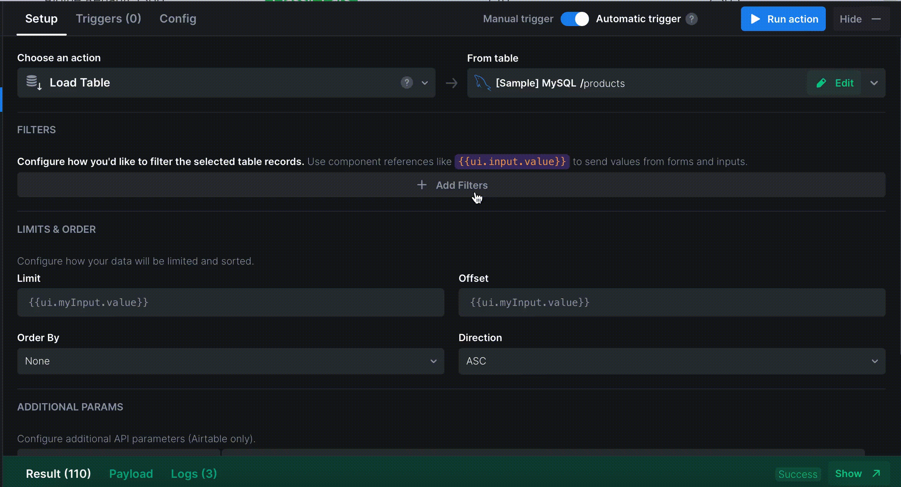
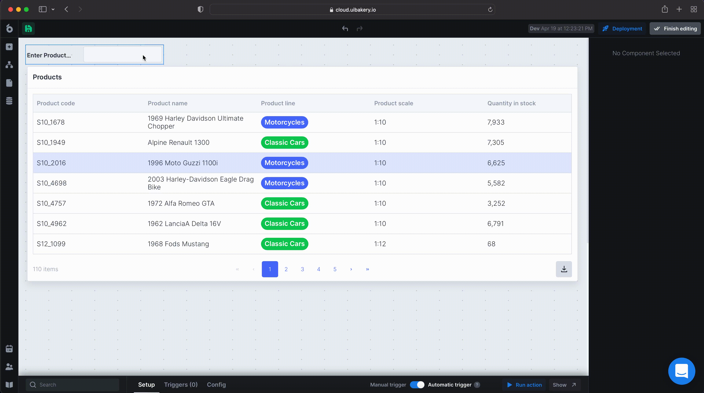

# Search table based on input value

You have created a new project and added a Table to [view and interact with your data](https://docs.uibakery.io/basics/starter-guide/load-and-display-data). Now, let’s add a search bar to be able to filter the data by a certain column/columns.

Find an **Input** component and drag-and-drop it above the Table.&#x20;

Let’s configure the Input to search for the records by certain criteria. For instance, for the Products table, we would like to search for a product by a Product Code. Start with add a descriptive label or a placeholder for the input.

Now, you can configure the Input to return the data based on a certain trigger.  Follow the below steps.

1. Click somewhere on the Input to open its _**Main settings**_ and scroll down the **Triggers** tab.  Rename the input so you have a unique identifier and don’t get confused later by the input values. In our example, we’ll rename the input to “`productCode`”

2\. Select the “**On Change**” trigger and choose an action that loads the data to your selected Table.&#x20;

.gif>)

However, the action itself does not filter the data. And since we only need to see the records corresponding to certain criteria, let’s add filtering to reduce the amount of the returned values.

3\. Proceed to the **Actions** pane and add a new Filter. Set a column that should be used for filtering, and reference an input value as a variable - `{{ ui.inputName.value}}`

Now, anytime you insert a value into the input, the action is executed. It processes the filter criteria and returns only the required values, that are displayed in the Table.

