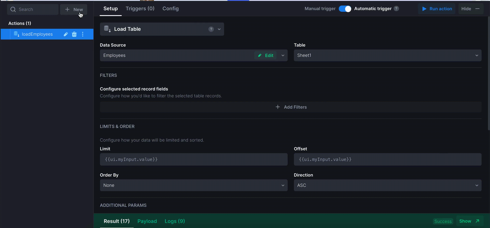

# Refresh data at a certain interval

If your data is dynamically changing in the database, you might want to refresh your table at a certain interval. Here's how to set up automatic refresh:

* add a new action - **Code**. Specify the sample code as in the example below (make sure to set up the required interval):

```javascript
const { interval } = await requireAsync('rxjs');
return interval(1000);
```


* _**On Success**_ trigger of the action, assign the action that loads data into the table;



* assign this action _**On Init**_ trigger of the table.


