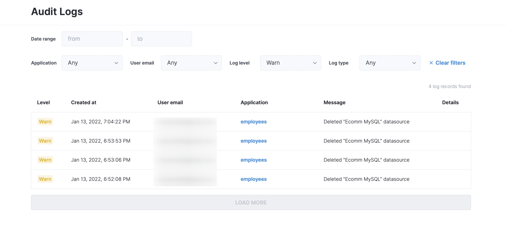

# Audit logs


Audit logs are available on Team and Enterprise plans


As your team grows and more teammates use your applications on a daily basis, it's important to keep track of changes that have been made or errors that someone could have received to help them troubleshoot. Here's when audit logs come in handy.

To open audit logs, click on your Organization settings and find the **Audit logs** tab.


Audit logs are available to users with an admin role


Audit logs can be filtered by a certain time period, by a user, an app. You can select certain log level:

* log;
* warn;
* error

The following events are logged:

* Login;
* Sign up;
* New app creation;
* Data source actions (add, update, delete);
* User invite;
* App deployment;
* App opening;
* Error opening an app;
* Page view;
* Action execution;
* Error during action execution.
