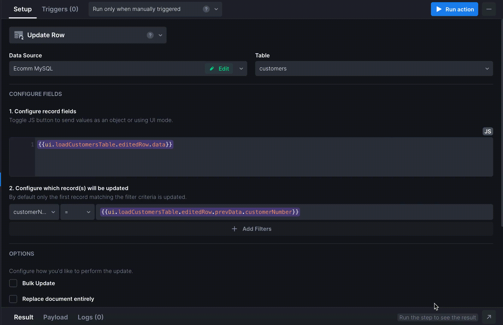

# II. Displaying and filtering data in a Table

In this section, we will display Customers' data in the Table, customize Table's look by hiding some columns and add a filtering option by Customer Name. Let's go!&#x20;

### Loading the data

Let’s start with loading the data from the first table, Customers.&#x20;

1. [Add a new Action](https://docs.uibakery.io/basics/working-with-actions#creating-an-action) - **Load Table**.&#x20;
2. Specify the **Data** **Source** and select the Customers table from the **Tables** list&#x20;
3. Click **Run Action** and check the **Result** tab for the outcome.&#x20;

If the request is <mark style="color:green;">successful</mark>, the Result tab will be highlighted in <mark style="color:green;">green</mark>. In case of any errors, the tab will be highlighted in <mark style="color:red;">red</mark>, and you will be able to troubleshoot right there.

.gif>)

### Customizing the Table with options

Let’s display the Customers data. Find a **Table** component and drag it to the canvas. The Table will already have the data inside, as the Action is automatically tied to the Component.

We won’t need all the data in the Table, that’s why we can groom it a little. Start with hiding the unnecessary columns in the right **Columns** menu by clicking on the eye icon. To unhide the column, just click on the eye icon again.

#### Edit option

Next, let’s make sure we can make edits to the records directly from the Table. To do that, first, navigate the _**Appearance\&Style**_ tab in the right menu and check the _**Edit**_ option. You’ll notice an Edit label appears on each row of the table.

To ensure the updated data is sent back to the data source, we’ll need to add a corresponding action:

1. [Add a new Action](https://docs.uibakery.io/basics/working-with-actions#creating-an-action) and rename it to _UpdateCustomerRecord_ - select action step **Update Row**
2. Specify how to identify the updated record and how to map the changes: `{{ ui.customersTable.editedRow.data }}`
3. Next, identify the record that will be updated, e.g. by a customer number by `{{ ui.customersTable.editedRow.prevData.customerNumber }}`&#x20;
4. Lastly, since the Table needs to be updated with the new data, switch to the **Triggers** tab, and assign the _loadCustomers_ action on Success.

Once done, we can bind the _Update_ action to the _**Trigger**_ that should actually call for this Action. To do that, open the _**Triggers**_ tab and select the update action in the list for _**On Edit**_ trigger.

Great! Let’s add some filtering options now.

### Filtering the data

1. Find an **Input** component and drag it onto the canvas.&#x20;
2. On the _**Appearance\&Style**_ tab, set a placeholder for the Input - _Enter Customer Name_.&#x20;
3. Next, go to the **Triggers** tab and on the _**On Change**_ trigger, find the _loadCustomers_ action in the list.&#x20;
4. Lastly, add a filter to the Action to return the values corresponding to the Customer Name filter. We will apply a strict condition, so the filter should be `Customer name = {{ ui.customerName.value }}`

Nice job! You’ve completed the first milestone and have added a Table and applied filters to it for easier navigation through the records. Let’s add some Customer statistics to our dashboard as a next step.
