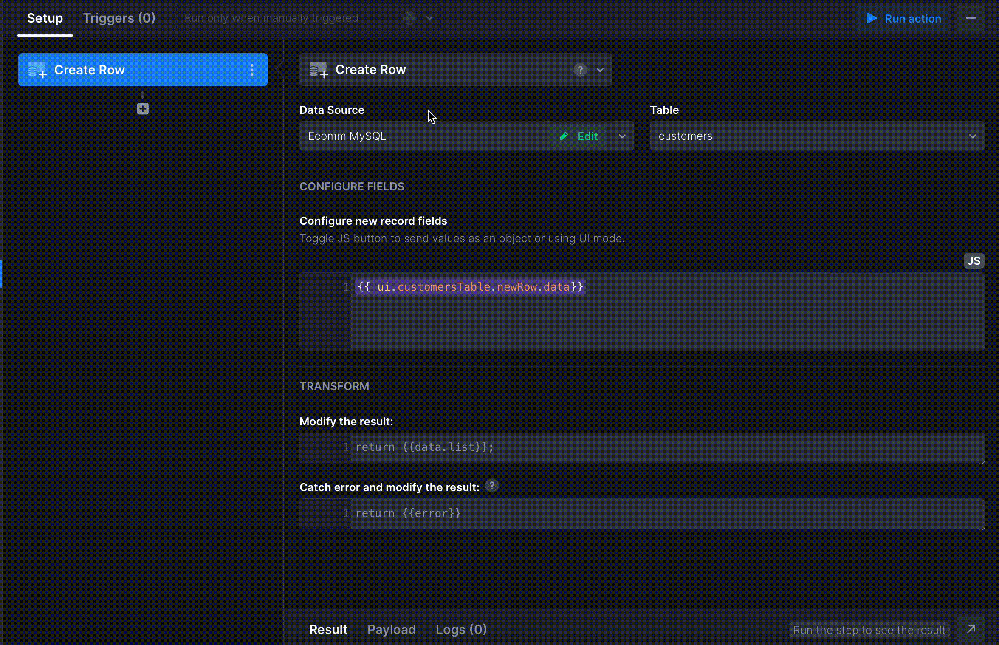

# IV. Adding Form to add new data

In this section, we will add a Form component to add new Customers. Here's the final look of the dashboard we'll get:

Start with placing a **Form** component onto the working area near the Table. You will notice that the Form has inherited the structure of the Table. You can hide the fields that you don't need in the Form, e.g. Customer Number field is assigned automatically, so there's no need to keep it in the Form.&#x20;

Let's now add an Action that will send new data to the data source:

1. Add a new Workflow - **Create Row**
2. Specify how to identify the new record and how to map the new data: `{{ ui.customersTable.newRow.data}}`
3. To ensure the data is then sent to the data source and the table is updated, switch to the **Triggers** tab and assign the _loadCustomers_ action on Success.

Now, this Action can be tied to a Trigger:

* click anywhere in the Form to open the right menu
* open the _**Triggers\&Condition**_ tab
* find _**On Submit**_ trigger and select _createCustomers_ Action from the list

Congrats! 🥳 We are only a few steps away from completing the Customer Orders Dashboard. As the final step, we will add a separate page that will host all of the Customer’s details and create corresponding relations between the Forms and Tables.
